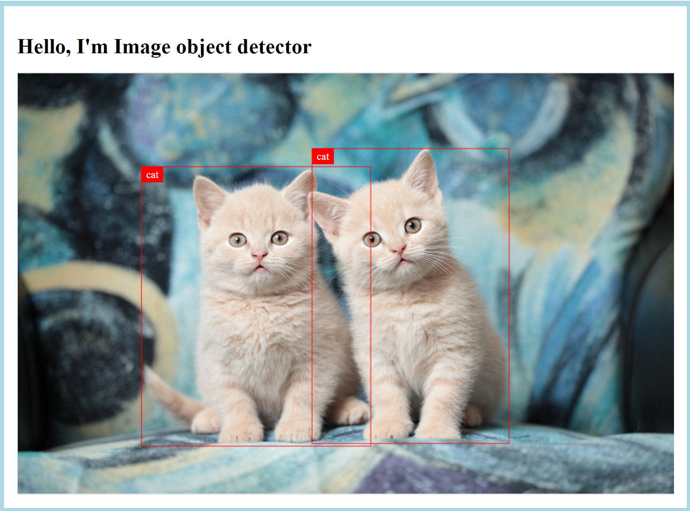

# Студенческий проект по детекции объектов на изображении

Веб-сервис, определяющий природу объекта и его положение по изображению из пользовательского URL.

Пример работы:


[Ссылка на работающий проект](http://51.250.81.158/image_object_detector).

## Для создания использованы:

1. Фреймворк Django;
2. ML-модель [facebook/detr-resnet-50](https://huggingface.co/facebook/detr-resnet-50) с HuggingFace;
3. Yandex.Cloud - для развертывания.

## Состав команды:

1. Юрий Чупахин — тимлид, подготовка модели, тесты, развертывание;
2. Сергей Белевский — Django, подготовка модели, тесты, развертывание;
3. Александр Медовиков — подготовка модели, тесты, развертывание.

## Деплой
Запустите файл  
```bash
./script/deploy.sh
```
## Тесты

* Запуск тестов в локальном окружении:

```bash
./script/run_tests.sh
```
